# avctl 6.2: setup guide for friends

Follow this guide from top to bottom: install Core, complete the six setup
screens in order, then connect your phone. Each optional component explains
how to skip it when you reach that screen.

## Start here: install Core on the Mac

- Core needs an **Apple-silicon Mac running macOS 14 or newer**, an internet
  connection, and permission to install software. You do not need Python,
  Homebrew, Xcode, or the source repository to install Core.
- Keep the Core Mac awake and its user logged in while using avctl. A MacBook
  works too; closing its lid or putting it to sleep can disconnect the remote.

1. Open [release 6.2](https://github.com/yongqinw/avctl-public/releases/tag/6.2).
   Under **Assets**, download and open `Avctl-Server-6.2.pkg`.
   If the release cannot be reached, ask the app publisher for the installer file.
2. Version 6.2's installer is unsigned and not notarized. If macOS blocks it
   because the developer cannot be verified, and you trust the copy supplied
   by the app publisher, open **System Settings → Privacy & Security → Open Anyway**
   after trying to open it. Follow the confirmation prompts.
   [Apple's instructions](https://support.apple.com/102445).
3. Follow Installer and enter the Mac administrator password when requested.
   The package installs **Avctl Server.app** in Applications and starts Core.
4. Setup should open automatically in your browser. If it does not, open
   **Applications → Avctl Server**. This uses the port selected for your Mac.
5. On a normal first installation, you can also open
   [http://127.0.0.1:8000/setup](http://127.0.0.1:8000/setup) on that same Mac.
   `/bootstrap` works too. If port 8000 was occupied, the installer chooses
   another free port through 8099; opening the app finds it for you.

Use a slash: `:8000/setup`, not `:8000:setup`. On an iPhone, `127.0.0.1`
means the iPhone itself, so use the Mac's Tailscale address there instead.

The browser now shows these six screens:
**Check → Music → Panels → Devices → Access → Review**.

## Wizard step 1: Check

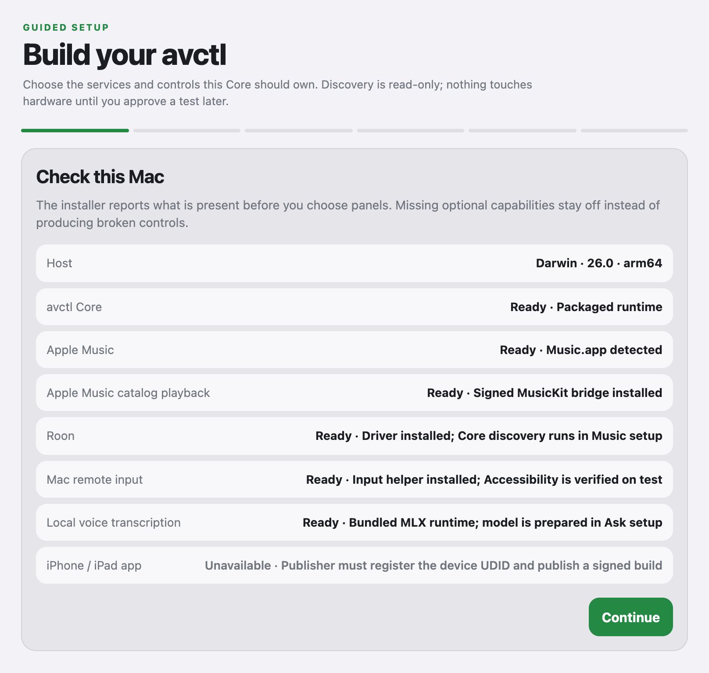

*Figure 1. Check this Mac, then Continue. The figures in this guide show the
6.2 setup panels with example device names, status, and addresses. Use your
own device values; credential fields are left empty.*

Read the component list. **Ready** means the component is present; it does
not mean you have authorized every account or connected every device.

Unavailable optional features can be skipped. For example, a missing published
phone build does not stop you setting up music in the Mac browser. If the Mac
itself is unsupported, ask the app publisher before continuing.

Click **Continue**. This step does not need keys or passwords.

## Wizard step 2: Music

Choose one music backend. Follow only its subsection below, then continue to
Panels. There is no “no music” choice.

### Roon + Qobuz

Choose this if you already use Roon. Qobuz is optional despite the label.
Your Roon Server can run on this Mac, another computer, or an appliance;
keep it on the same local network as the Core Mac.

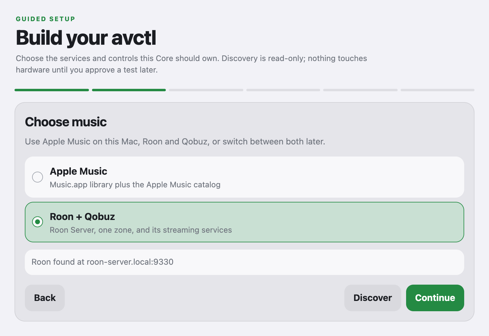

*Figure 2. Select Roon + Qobuz, click Discover, then Continue.*

1. First confirm that Roon Server is running and your desired speakers or
   headphones play from Roon.
   In Roon, **Settings → Audio** lets you enable and name audio devices;
   enabled devices become zones.
   [Roon audio setup](https://help.roonlabs.com/portal/en/kb/articles/audio-setup-basics).
2. If you use Qobuz, sign in inside **Roon → Settings → Services → Qobuz**.
   Skip this for a local-library-only setup.
   [Qobuz in Roon](https://help.roonlabs.com/portal/en/kb/articles/qobuz).
3. In avctl choose **Roon + Qobuz**, then click **Discover**. If several Roon
   servers appear, select the one that owns your library and audio zones.
4. Click **Continue** to reach Panels. You will authorize Roon and choose
   your playback zone when you reach Devices.

You do not obtain a Roon API key from a website. Approval in Roon creates the
authorization that avctl stores automatically.

### Apple Music

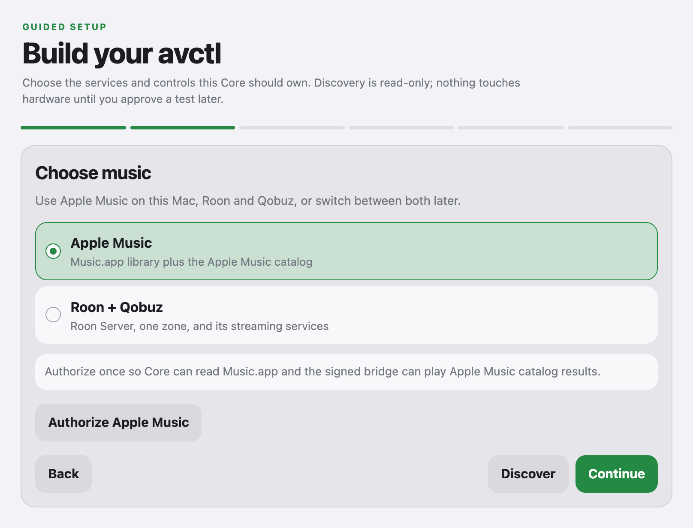

*Figure 3. If you use Apple Music, authorize it on this screen.*

1. Open Music on the Core Mac and sign in to your own Apple account. Streaming
   subscription tracks requires your own Apple Music subscription.
   Then choose **Apple Music** in avctl.
2. Click **Authorize Apple Music** and approve the Music access prompts on
   the Mac. Leave the browser open while macOS asks for permission.
3. Wait for **Apple Music ready**. If permission was denied, check
   **System Settings → Privacy & Security → Automation**, and **Media & Apple
   Music** when that category is shown, then retry authorization.
4. Click **Continue** to reach Panels. The Access screen later offers the
   additional service needed for Apple Music catalog features.

To skip Apple Music, select Roon. To skip Roon, select Apple Music.

## Wizard step 3: Panels — how to skip things

**Turn off every panel you do not need.** The initial configuration can include
all panels. Click an optional panel until it says **Skipped**.

For a simple first Roon setup, keep **Home** and **Music** and skip the other
panels. You can add them after music is working.

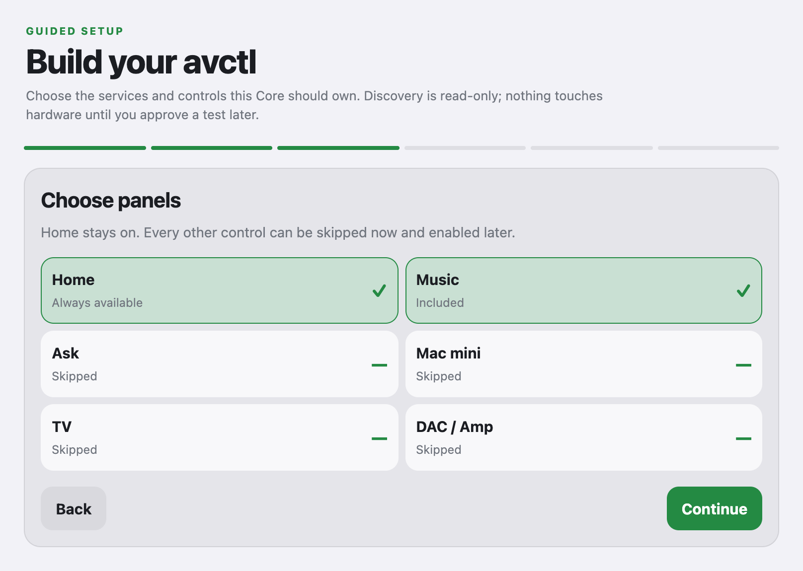

*Figure 4. A simple Roon setup. Click an optional panel to switch between
Included and Skipped.*

| Panel | Keep it when… | What skipping does |
| --- | --- | --- |
| **Home** | Always; this is required. | Cannot be skipped. |
| **Music** | You want library browsing, a queue, and playback controls. | Hides the Music panel; a music backend is still selected. |
| **Ask** | You want natural-language commands; you will set up Fireworks in Devices. | Removes Ask setup, including voice preparation. Ordinary music controls still work. |
| **Mac mini** | You want remote mouse/keyboard control of the Core Mac. | Skips the input helper and its Accessibility setup. It is unnecessary for normal music controls, including on a Mac mini. |
| **TV** | You have a supported LG webOS TV to control. | Removes TV setup. |
| **DAC / Amp** | You want supported Roon output controls or the supported physical rack hardware. | Removes both amplifier and DAC setup. |

There is no separate Skip button for each device. Use **Back** to return to
Panels and mark its panel **Skipped**, then continue. Leaving a selected
hardware panel's fields empty can prevent saving.

Click **Continue** to reach Devices.

## Wizard step 4: Devices

Work down this screen in the order below. Your music choice and selected
panels determine which sections appear. Skip any subsection you do not see.

### Roon authorization and choosing where music plays

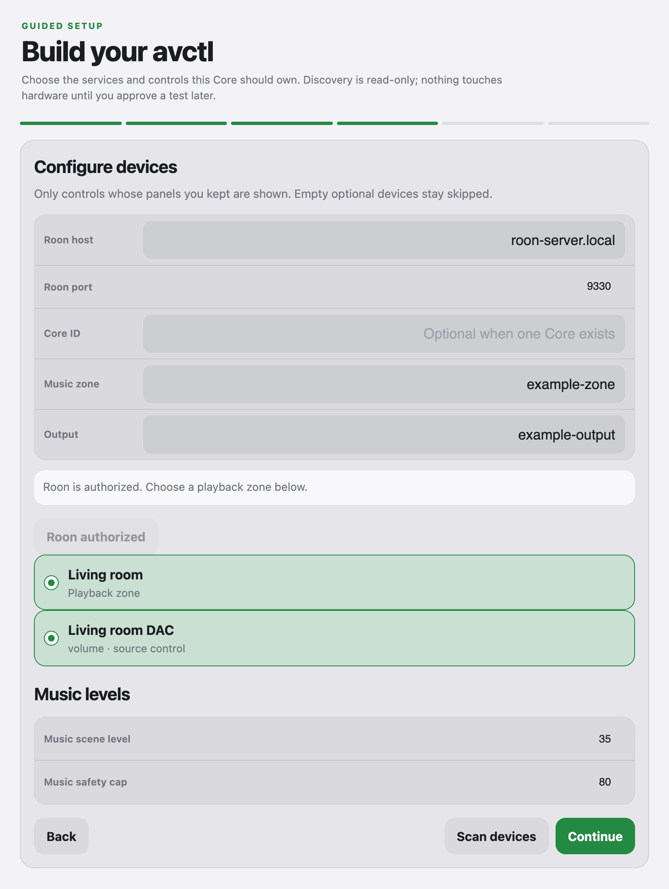

*Figure 5. After authorization, choose your zone and output by name.
“Living room” is an example.*

1. Check **Roon host** and **Roon port**. Discovery fills them; if entering
   them manually, enter both. The displayed `9330` placeholder is not a saved
   port and may not be your server's port.
2. Click **Authorize Roon**.
3. In the Roon app connected to that server, open **Settings → Extensions**
   and enable **avctl**. Some Roon versions put Extensions under Setup.
   Return to avctl and wait for **Roon authorized**.
   [Roon's extension authorization](https://github.com/RoonLabs/node-roon-api#connecting-to-a-roon-core).
4. Select the **Music zone** by its friendly name: for example, your living
   room or USB DAC. That selects where Roon plays; it does not necessarily
   play through the avctl Mac's speakers.
5. Select the **Output** belonging to that zone if you want DAC/amplifier
   control. With a single-output zone, avctl may select it automatically.
   Confirm the selection instead of inventing an ID or copying an example.

For music playback, a zone or output selection is required. For **Roon
volume** or **Roon output** rack controls, an output selection is required.
An output labeled **fixed level** does not provide normal adjustable volume;
use the equipment's volume control. Controls also depend on the source-control
capabilities reported beside that output.

If no zones appear, check **Settings → Audio** in Roon and ensure the output
is enabled and available for remote control. If discovery fails, confirm the
server is running on the same network; guest Wi-Fi can isolate devices.

### Music levels

**Music scene level** is the level used when the Music scene runs.
**Music safety cap** limits the level avctl can request. Start conservatively
for your equipment; these numbers are not a loudness measurement.

Music values must be between **0 and 80**, and scene level must be no greater
than the cap. If you lower the cap, lower the scene level too. **Zero is valid**
but can make playback silent. A fixed-level output still needs its own physical
volume control.

### Ask provider — optional

If this section is absent, continue to Mac mini control below. To skip Ask
when it is shown, go **Back → Panels**, mark **Ask** as **Skipped**, and
return to Devices. Ordinary music controls work without Ask.

To enable Ask, you need an API key from your own Fireworks account. This lets
avctl send your requests to the AI service.

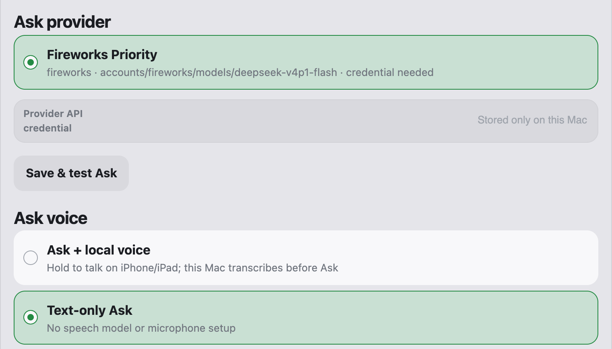

*Figure 6. The Fireworks key goes in Provider API credential. Voice choices
are directly below it on the same Devices screen.*

1. In avctl select **Fireworks Priority**. Version 6.2 uses **DeepSeek v4.1
   Flash**, model `accounts/fireworks/models/deepseek-v4p1-flash`.
2. Open the [Fireworks dashboard](https://app.fireworks.ai/) in another tab
   and create an account if you do not have one. Complete its sign-in/onboarding
   prompts using your own account.
3. Open [API Keys](https://app.fireworks.ai/settings/users/api-keys), choose
   **Create API key**, and use a recognizable name such as `avctl-home` if
   asked. Copy the generated key into a password manager. If the screen has
   moved, follow the dashboard link in the
   [official quickstart](https://docs.fireworks.ai/getting-started/quickstart).
4. In the dashboard's **Billing** area, check your balance. If credits are
   needed, add a payment method and purchase credits using the options shown.
   Review any automatic-reload option before enabling it. A depleted balance
   can stop API requests. You do not need to deploy a model server for
   avctl's bundled profile.
   [Fireworks credit setup](https://fireworks.ai/blog/billing-migration-to-prepaid).
5. Return to avctl. Paste **only the key** into **Provider API credential**,
   without `Bearer`, quotes, or an API URL. Click **Save & test Ask** and wait for **Tool calls
   verified**. This contacts Fireworks and uses the account's API quota or
   billing; a chat subscription elsewhere is not a Fireworks API credential.

The key is saved privately on your Core. Fireworks usage is charged to your
Fireworks account. If the test reports authentication, credit, or quota
errors, check the Fireworks account or ask the app publisher for help. Do not
post your key in screenshots or issues.

Keeping Ask selected with a missing key prevents saving.

### Ask voice — optional

This follows Ask provider on the same screen:

- Choose **Text-only Ask** to skip voice and type your requests.
- For spoken commands, choose **Ask + local voice**, click **Prepare voice**,
  and wait for **Voice ready**. Initial preparation downloads a model and can
  take time. Keeping voice selected without preparation prevents saving.

### Mac mini control — optional

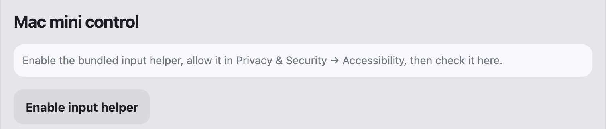

*Figure 7. Enable remote input only if you kept the Mac mini panel.*

Click **Enable input helper**. On the Mac, open **System Settings → Privacy &
Security → Accessibility** and allow the avctl input helper, then return and
click **Check accessibility**. This permission enables remote input.

To skip it, mark **Mac mini** as **Skipped** in Panels. You can still control
music without this permission.

### LG webOS TV — optional

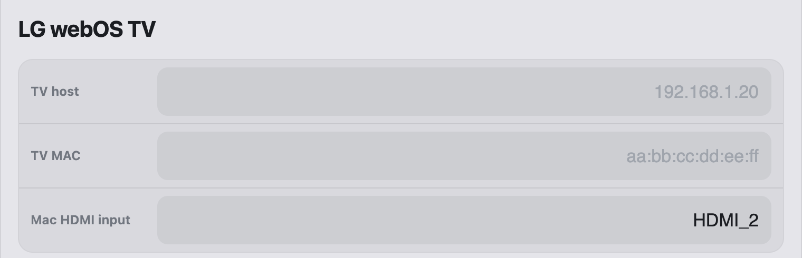

*Figure 8. Enter the details of your supported TV, or skip TV in Panels.*

Click **Scan devices** or enter **TV host** manually. Fill in **TV MAC** from
the TV's network settings or your router, using colon-separated format such
as `aa:bb:cc:dd:ee:ff`; discovery may only find the host. Enter the HDMI input
connected to your Mac, such as `HDMI_2`. Keep the TV on for initial connection
and approve its pairing prompt if shown.

If pairing needs further help, ask the app publisher; do not invent a pairing key. To
skip the TV, mark **TV** as **Skipped** in Panels.

### Amplifier — optional

This and the following DAC section appear when you keep **DAC / Amp**.
To skip both, go **Back → Panels**, mark **DAC / Amp** as **Skipped**, and
return to Devices. There is no individual “None” choice for just one section.

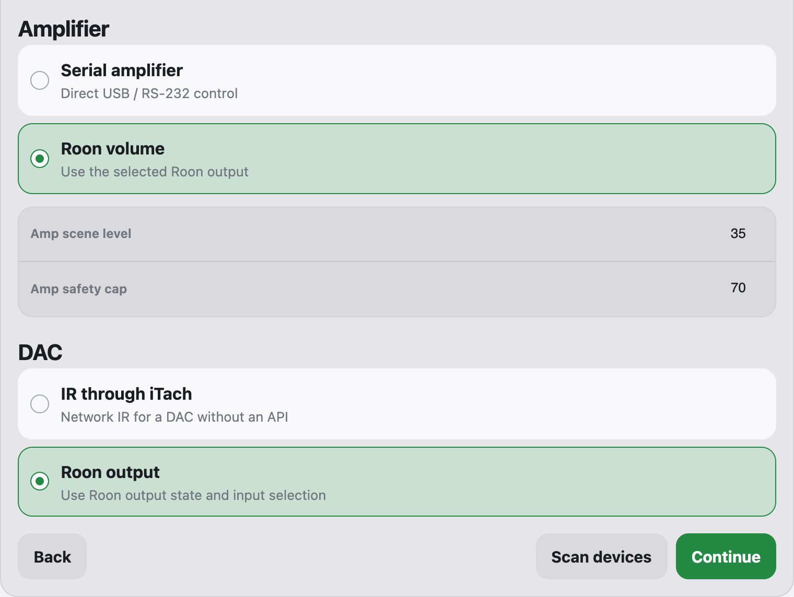

*Figure 9. For Roon controls, select Roon volume under Amplifier and Roon
output under DAC. Configure both sections.*

For a Roon setup, choose **Roon volume**. Scroll up and confirm the
corresponding Roon **Output** is selected. If you chose Apple Music earlier,
the Roon fields now appear above; authorize Roon there before selecting its output.

The **Serial amplifier** alternative is specifically for a **McIntosh
MAC7200**. For that hardware, connect the matching USB/RS-232 interface, click
**Scan devices**, and select its `/dev/cu.…` port. Skip DAC / Amp if neither
control method fits your equipment.

**Amp scene level** must not exceed **Amp safety cap**, and both must be
between **0 and 70**. Lower the scene level if you lower the cap.

### DAC — optional

For a Roon setup, choose **Roon output** and confirm the Roon **Output**
selected above. Changing Amplifier to Roon volume does not change this choice
automatically; select Roon output here too.

The **IR through iTach** alternative uses the **Topping D900** driver. For
that hardware, enter the iTach's host and connected IR port, **1**, **2**, or
**3**. Ask the app publisher for the matching hardware configuration first:
the installer does not include learned D900 IR commands, and this wizard
cannot learn them.
Skip DAC / Amp if neither control method fits your equipment.

At the bottom of Devices, click **Continue** to reach Access.

## Wizard step 5: Access

### Core listening port

Keep the detected **Core listening port** unless you need another port.
A changed port takes effect after **Save setup** in Review. Finish this
screen first; after Core restarts, return to Access and enable/check Tailscale
Serve against the new running port.

### Tailscale — for connecting from your phone or another computer

If you will use avctl only in the browser on this Mac, you can skip Tailscale
for now and move down to **Apple services** on the same screen.

You can create and manage your **own Tailscale network**, called a tailnet.
Your Mac and phone join that network. Sign up with your own account; the app
publisher does not need to create it for you.

**Create your account and connect the Mac:**

1. Open [Tailscale](https://tailscale.com/) in another tab and choose **Get Started**. Sign
   up with your own supported sign-in account. For a personal setup, use the
   personal onboarding path and check the plan shown before accepting any
   paid option. [Tailscale quickstart](https://tailscale.com/kb/1017/install).
2. Download [Tailscale for Mac](https://tailscale.com/download/mac). Choose
   the standalone macOS app, install it, and open it from Applications.
3. Approve its network-extension and VPN-configuration prompts. If blocked on
   macOS 15 or newer, open **System Settings → General → Login Items &
   Extensions → Network Extensions** and allow Tailscale. On macOS 14, use
   the Tailscale **Allow** prompt under **Privacy & Security**.
   [Tailscale's Mac permission steps](https://tailscale.com/docs/concepts/macos-sysext).
4. Use the Tailscale menu-bar icon to **Log in**. Finish browser sign-in with
   the account you just created, then connect. Keep Tailscale running.
5. Open the [Machines page](https://login.tailscale.com/admin/machines) and
   confirm your Mac is listed and connected. You manage this personal
   network yourself; the app publisher does not need to create it for you.

**Enable the avctl HTTPS address:**

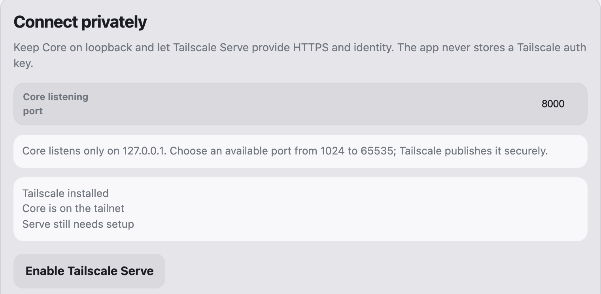

*Figure 10. After signing in and checking Tailscale, enable Serve here.*

1. Return to avctl's **Access** step and click **Check Tailscale** at the
   bottom. Scroll back up to the status; it should report that Tailscale is
   installed and Core is on the tailnet.
2. Click **Enable Tailscale Serve**. Complete any HTTPS consent link it shows,
   then retry/check again. Serve makes Core reachable within your tailnet.
   [Tailscale Serve](https://tailscale.com/docs/features/tailscale-serve).
3. If HTTPS setup needs manual attention, open your
   [Tailscale DNS settings](https://login.tailscale.com/admin/dns). Enable
   **MagicDNS** if needed, then **HTTPS Certificates → Enable HTTPS** and
   review the confirmation. Return to avctl and retry **Enable Tailscale
   Serve**. You do not need to generate or upload certificate files yourself.
   [Tailscale HTTPS setup](https://tailscale.com/docs/how-to/set-up-https-certificates).
4. Copy the **Enter in the phone app** address, such as
   `https://your-mac.your-tailnet.ts.net`. Save the actual address displayed
   for the phone setup after Review. This address connects to **your Mac**.

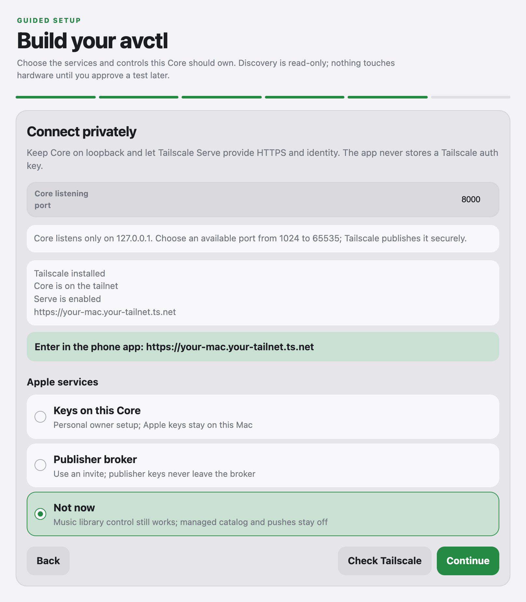

*Figure 11. Copy your own Core address. Apple services is the next section
below; Not now is selected in this example.*

No exit node, router port forwarding, public Funnel, or Tailscale auth key
is needed for this connection. Continue down to **Apple services**.

### Apple services

This is the next section on the same Access screen.

**For a simple Roon setup, choose Not now**, then click **Continue** to reach
Review. You can also choose Not now for Music.app library control without
Apple catalog services. This choice requires no code or Apple signing keys.

**For Apple Music catalog features or background Apple notifications, choose
Publisher broker.** This uses an Apple service hosted by the app publisher.
After you select it, two fields appear:

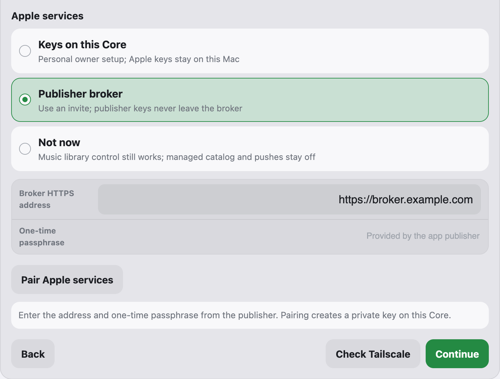

*Figure 12. Only Publisher broker asks for this passphrase. Request it from
the app publisher when you reach this field, or choose Not now to continue
without it. The broker address shown here is an example.*

1. **Broker HTTPS address:** keep the address prefilled by your installer.
   The public guide shows `https://broker.example.com` as an example only;
   do not replace the installer's address with it. If the field is blank, ask
   the app publisher for the correct address. Your phone will still use your
   own Core address.
2. **One-time passphrase:** ask the app publisher privately, “I'm at Access →
   Apple services in avctl setup. Please send me a one-time passphrase to pair
   this Mac.” The publisher generates this invitation for you. It is used
   once to register your Mac, and is separate from your Apple password or
   Fireworks key.
3. Paste what the publisher sends into **One-time passphrase** and click
   **Pair Apple services**. Wait for **Paired**.
4. If it has expired or was already used, ask the publisher for a new one.
   After successful pairing you do not need to re-enter it on every launch.

If you do not have the passphrase yet, select **Not now** to finish setup.
You can return to this screen and pair later. Keeping **Publisher broker**
selected without pairing prevents saving.

**Keys on this Core** is for an owner who has already configured their own
Apple signing keys. With Publisher broker, the publisher manages those keys;
you do not obtain `.p8` files or buy an Apple Developer membership. You still
need your own Apple Music subscription and Music access permission for streaming.

After **Paired**, or after choosing **Not now**, click **Continue** to reach
Review.

## Wizard step 6: Review and save

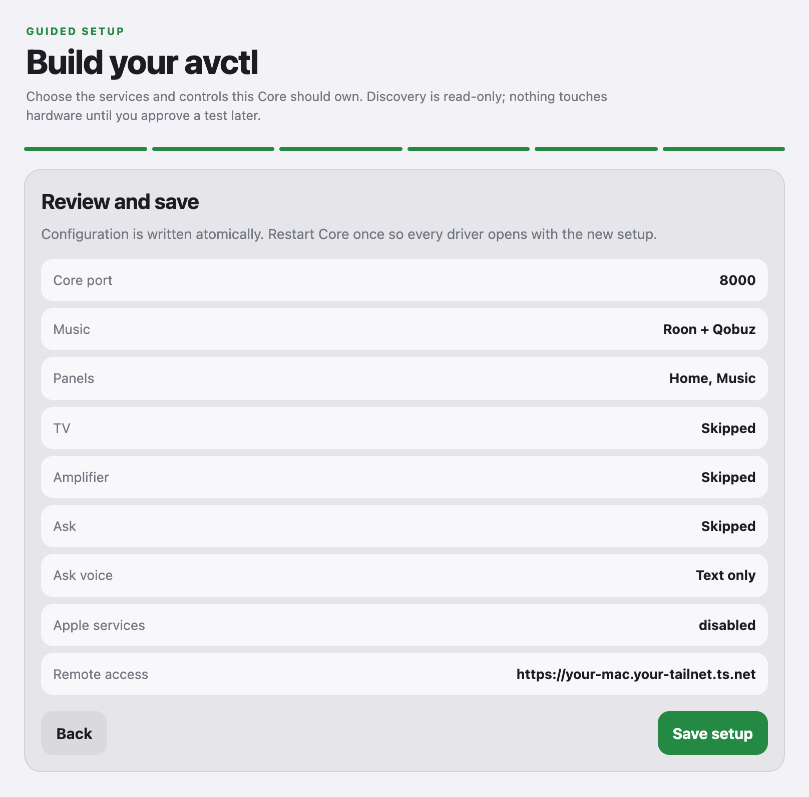

*Figure 13. Check your choices, then click Save setup. Apple services shows
“disabled” here when you selected Not now; that is expected.*

Check your music backend, playback destination, selected panels, and volume
levels. Click **Save setup**. Core saves your choices and restarts once; allow
the page to reconnect. If it does not, reopen **Avctl Server** from Applications.

Test a track with ordinary **Music** controls first. If that works and you
enabled **Ask**, try a simple request such as “Play some jazz.” For
Roon, confirm the selected Roon zone is the one you hear. For silent playback,
check the current Music/output volume and mute state. The scene level applies
when you run the Music scene; changing it does not immediately change volume.

To change your choices later, open **Avctl Server** again. You can reopen the
wizard and enable panels that you skipped. Your saved setup is kept when you
install a newer Core package.

## Install the iPhone or iPad app

Core setup is now finished. This part is optional: you can keep using avctl
in the Mac browser. The current native phone project requires **iOS/iPadOS 26
or newer**; ask the app publisher about compatibility with an older device.

The Mac `.pkg` does not install the phone app. The current shared phone build
is development-signed: the app publisher must register each device before it
can install, and the device needs Developer Mode. A download page does not
bypass those Apple requirements.

### 1. Get the device UDID from Xcode and send it to the app publisher

1. On a Mac with Xcode, connect the iPhone/iPad using a data-capable USB cable.
   Unlock the device and approve **Trust This Computer** if asked.
2. Open Xcode. Choose **Window → Devices and Simulators → Devices**, or open
   **Device Hub** if your Xcode version uses that interface.
3. Select the connected **physical device**, not a simulator. Wait for pairing
   to finish and copy the field labeled **Identifier**. This is its **UDID**.
4. Send the app publisher the UDID privately, together with the device
   name/model and iOS/iPadOS version. Copy the identifier exactly; a serial
   number, IMEI, or Apple Account email is not a substitute.
5. Wait for the publisher to confirm that the device is registered and a
   build with the updated provisioning profile has been published before
   continuing.

You do not need the app publisher's Apple Account password or signing keys.
If you do not have access to a Mac with Xcode, ask the publisher to help
collect the identifier.
[Apple's registered-device instructions](https://developer.apple.com/documentation/xcode/distributing-your-app-to-registered-devices).

### 2. Enable Developer Mode on the iPhone/iPad

1. After pairing with Xcode, open **Settings → Privacy & Security → Developer
   Mode** on the device.
2. Turn it on and accept **Restart**.
3. After restarting, unlock the device, confirm **Enable/Turn On**, and enter
   your device passcode when asked.

If Developer Mode is missing, first initiate pairing with Xcode as described
above, then check Settings again. Keep it enabled while using this
development-signed build. Developer Mode alone does not register your UDID.
[Apple's Developer Mode instructions](https://developer.apple.com/documentation/xcode/enabling-developer-mode-on-a-device).

### 3. Download the app from the shared page

Ask the app publisher for the phone-app installation link after your device
has been registered. On the iPhone/iPad, open **Safari** and visit that link.
An address such as `https://apps.example.com/app` is an **example only**, not
a working app download. This repository does not supply a phone-app endpoint.

On the publisher's page, tap **Install**, accept iOS's installation
confirmation, and wait for the avctl icon to finish installing. Open it when
ready. Use that page for updates after the publisher makes a new build available.

The publisher manages download access. The installed app connects privately
to your own Mac through Tailscale. You do not paste the broker invitation or
Fireworks key into the download page.

### 4. Connect the phone app to your own Core

If you skipped Tailscale in Access, complete that Mac setup first.

1. Install/open [Tailscale on the phone](https://tailscale.com/download/ios)
   and allow the VPN configuration. Sign in using the **same account and
   sign-in provider** as on the Mac. If offered several tailnets, select the
   one containing your Core Mac, then turn on the connection.
   [Tailscale's iOS instructions](https://tailscale.com/docs/install/ios).
2. Confirm both devices appear in your
   [Tailscale Machines page](https://login.tailscale.com/admin/machines).
   In Safari on the phone, open your Core's HTTPS address saved from Access.
   Check that the avctl panel opens.
3. Open avctl. Under **Core address**, enter the HTTPS address shown by
   **your Mac's Access step**, with no `/app` suffix.
4. Leave **Bearer token (optional with Tailscale)** empty for normal Tailscale
   access. Tap **Pair with Core**.
5. Allow relevant local-network, microphone, or notification prompts when you
   use those features. Microphone access is unnecessary for text-only Ask.

Keep Tailscale connected on both devices and the Core Mac awake. If access
stops, check whether either device needs to sign in again.

For background Apple notifications, pair the publisher broker on Core too and
ask the app publisher if the published phone build needs additional notification setup.
Ordinary in-app control can be used while those extras are deferred.

You can skip the native app entirely and use avctl in a browser. From another
device, use your Core's Tailscale URL rather than the Mac-only localhost URL.

## If something gets stuck

| Symptom | What to do |
| --- | --- |
| Setup page cannot be reached | Open Avctl Server from Applications to use the saved port. For the original 6.1 permission issue, install 6.2. |
| Save asks for TV, serial, or iTach details you do not have | Go Back to Panels and skip TV and/or DAC / Amp, or select both Roon modes for Roon rack control. |
| Save rejects a volume | Keep each scene level at or below its cap; lowering the cap does not change the scene level automatically. |
| Roon is waiting for authorization | Enable avctl in Roon on the correct server, then return to the wizard. |
| Ask will not configure | Check the Fireworks key/account and run Save & test Ask, or skip Ask. The broker passphrase is not a Fireworks key. |
| Voice preparation is slow or fails | Choose Text-only Ask and prepare voice later. |
| Broker invite is invalid | Ask the app publisher for a new one; do not reuse someone else's invitation. |
| `/app` asks for an avctl token, or returns 401/404 | Ask the app publisher to check the supplied download link and published build. The install page, its manifest, and the IPA must all be reachable for phone installation. |
| iOS says the app cannot be installed or verified | Confirm the OS version, Developer Mode, and that the app publisher published a build containing this device's UDID. Expired profiles/certificates need a new build from the app publisher. |
| App installs but cannot connect | Use your own Core's HTTPS address, keep both devices on the same tailnet, and keep the Core Mac awake. |

When asking the app publisher for help, include the wizard step, the exact
error, your Mac/phone OS version, and whether you use Roon or Apple Music.
Keep API keys, passphrases, and account passwords out of screenshots.
